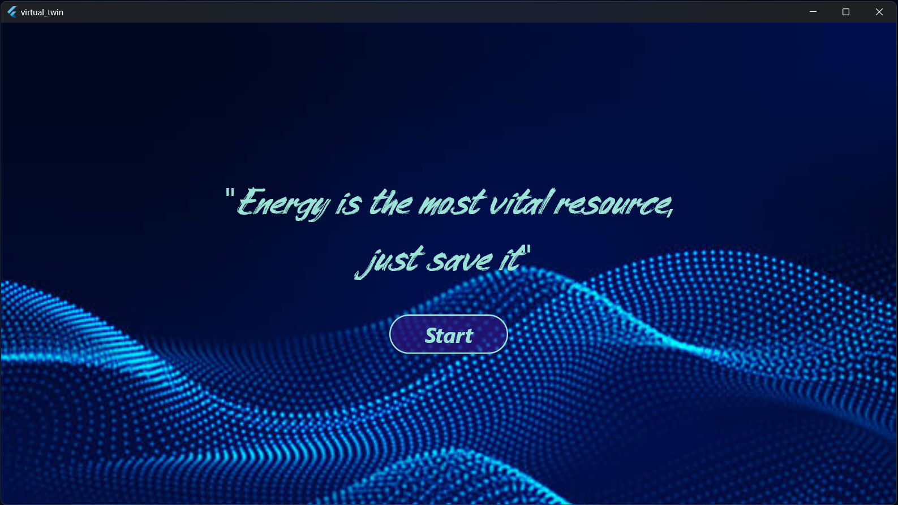

```markdown

# Project: Thermal Simulation and Weather Data API
This project provides an API to handle user authentication, calculate thermal dynamics based on external environmental data, and fetch weather-related information such as temperature, humidity, and solar radiation. The application specifically calculates the time the air conditioner can be turned off while maintaining a comfortable temperature level, optimizing energy consumption in the process. The project uses Django and integrates with external APIs for weather and solar radiation data.

## Table of Contents

- [Installation](#installation)
- [Django Configuration](#django-configuration)
- [API Endpoints](#api-endpoints)
  - [Login](#login)
  - [Add User](#add-user)
  - [Calculate Time](#calculate-time)
  - [Fetch Weather](#fetch-weather)
  - [Get Times with Submission Time](#get-times-with-submission-time)
- [Thermal Calculation Explanation](#thermal-calculation-explanation)
- [Batch File to Run the Server Automatically](#batch-file-to-run-the-server-automatically)

## Installation

To get started with the project, follow these steps:

1. **Clone the repository**:

    ```bash
    git clone <repository_url>
    cd <project_directory>
    ```

2. **Install dependencies**:

    This project uses Django, Requests, and other dependencies. Install them using `pip`:

    ```bash
    pip install -r requirements.txt
    ```

3. **Run migrations**:

    Set up the database:

    ```bash
    python manage.py migrate
    ```

4. **Create a superuser** (optional, for admin access):

    ```bash
    python manage.py createsuperuser
    ```

5. **Start the development server**:

    ```bash
    python manage.py runserver
    ```

    The server should now be running at `http://127.0.0.1:8000/`.

## Django Configuration

### Settings

1. **Add Installed Apps**:

   Ensure the following app is included in the `INSTALLED_APPS` in your `settings.py`:

   ```python
   INSTALLED_APPS = [
       # other apps
       'your_app_name',
   ]
   ```

2. **Database Configuration**:

   Make sure your database settings are correctly configured in the `settings.py` file. By default, Django uses SQLite, but you can configure it to use PostgreSQL, MySQL, etc.

   Example for SQLite:

   ```python
   DATABASES = {
       'default': {
           'ENGINE': 'django.db.backends.sqlite3',
           'NAME': BASE_DIR / 'db.sqlite3',
       }
   }
   ```

3. **External API Keys**:

   - `API_KEY_TEMP`: This key is for accessing the OpenWeatherMap API for temperature and humidity data. Replace with your actual key.
   - `API_KEY_SOLAR_RAD`: This key is for accessing the Weatherbit API for solar radiation data. Replace with your actual key.

   You can set these in your `settings.py`:

   ```python
   API_KEY_TEMP = 'your_openweathermap_api_key'
   API_KEY_SOLAR_RAD = 'your_weatherbit_api_key'
   ```

4. **CSRF Exemption**:

   The views in this project use `@csrf_exempt` to disable CSRF protection. Ensure that this is appropriate for your environment.

   ```python
   from django.views.decorators.csrf import csrf_exempt
   ```

## API Endpoints

### Login

- **Endpoint**: `POST /login/`
- **Description**: Authenticates the user by providing a username and password.
- **Request Body**:

    ```json
    {
      "username": "your_username",
      "password": "your_password"
    }
    ```

- **Response**:

    ```json
    {
      "status": "success",
      "is_staff": true
    }
    ```

### Add User

- **Endpoint**: `POST /add_user/`
- **Description**: Adds a new user with a specified role.
- **Request Body**:

    ```json
    {
      "username": "new_username",
      "email": "user@example.com",
      "password": "user_password",
      "role": "Admin"
    }
    ```

- **Response**:

    ```json
    {
      "status": "success"
    }
    ```

### Calculate Time

- **Endpoint**: `POST /calculate_time/`
- **Description**: Calculates the time required for thermal dynamics based on the provided temperature range, external temperature, and solar radiation. The calculation helps determine the time the air conditioner can be turned off while maintaining a comfortable temperature, optimizing energy consumption.
- **Request Body**:

    ```json
    {
      "min_temp": 20,
      "max_temp": 25
    }
    ```

- **Response**:

    ```json
    {
      "time": 45.5
    }
    ```

### Fetch Weather

- **Endpoint**: `POST /fetch_weather/`
- **Description**: Fetches the current weather data including temperature, humidity, and solar radiation.
- **Response**:

    ```json
    {
      "temp": 22.5,
      "hum": 60,
      "solar_rad": 500
    }
    ```

### Get Times with Submission Time

- **Endpoint**: `POST /get_times_with_submission_time/`
- **Description**: Fetches the recorded times with submission timestamps.
- **Response**:

    ```json
    {
      "records": [
        {
          "time_in_minutes": 45.5,
          "submission_time": "2024-11-12 14:30:00"
        }
      ]
    }
    ```

## Thermal Calculation Explanation

The **`calculate_time`** view is used to calculate the time required to achieve a target temperature in a room or space based on several factors including internal and external temperature, heat convection, and solar radiation. The calculation is based on thermodynamic principles and is as follows:

1. **Inputs**:
   - `min_temp`: The minimum temperature (°C).
   - `max_temp`: The target maximum temperature (°C).
   - `T0`: Initial internal temperature (converted to Kelvin).
   - `T_target`: Target temperature (converted to Kelvin).
   - `T_ext`: External temperature (converted to Kelvin, fetched from an API).

2. **Thermal Constants**:
   - `rho`: Air density (kg/m³).
   - `cp`: Specific heat capacity (J/kg·K).
   - `h_int`: Internal heat transfer coefficient (W/m²·K).
   - `h_ext`: External heat transfer coefficient (W/m²·K).
   - `A_int`: Internal surface area (m²).
   - `A_ext`: External surface area (m²).
   - `A_verre`: Area of windows (m²).
   - `V`: Volume of the space (m³).
   - `alpha`: Solar radiation absorption coefficient.
   - `Is`: Solar radiation intensity (W/m², fetched from the API).

3. **Formulae**:
   - **Internal convection**: `Q_conv_int = h_int * A_int * (T0 - T_ext)`
   - **External convection**: `Q_conv_ext = h_ext * A_ext * (T_ext - T0)`
   - **Solar radiation**: `Q_sol = alpha * Is * A_verre`
   - **Total heat gain**: `Q_total = Q_conv_int + Q_conv_ext + Q_sol`
   - **Time calculation**: Based on the equation:
     \[
     \text{time\_in\_minutes} = \frac{-\rho \cdot c_p \cdot V \cdot \ln\left(\frac{T_{\text{target}} - T_{\text{ext}} + \frac{Q_{\text{total}}}{h_{\text{total}}}}{T_0 - T_{\text{ext}} + \frac{Q_{\text{total}}}{h_{\text{total}}}}\right)}{h_{\text{total}} \cdot 60}
     \]

4. **Output**:
   The result is the calculated time in minutes to reach the target temperature, which is stored in the `TimeRecord` model.

---

## Batch File to Run the Server Automatically

To automatically start the Django server, create a batch file `start_server.bat` with the following content:

```batch
@echo off
cd D:\cours_II2\S2\stage\Application\back
call venv\Scripts\activate
python manage.py runserver
```

This batch file will:
1. Change the directory to your Django project.
2. Activate the virtual environment.
3. Run the Django development server.

To run the server, simply lunch the application and the server will be automatically run.

## Demo Video

Watch the [demo video](https://drive.google.com/file/d/1TByyJViEFk3Ir35nVbuf0fx1i7I-YgFn/view?usp=sharing) of the smart curtain system in action.

[](https://drive.google.com/file/d/1TByyJViEFk3Ir35nVbuf0fx1i7I-YgFn/view?usp=sharing)


---
